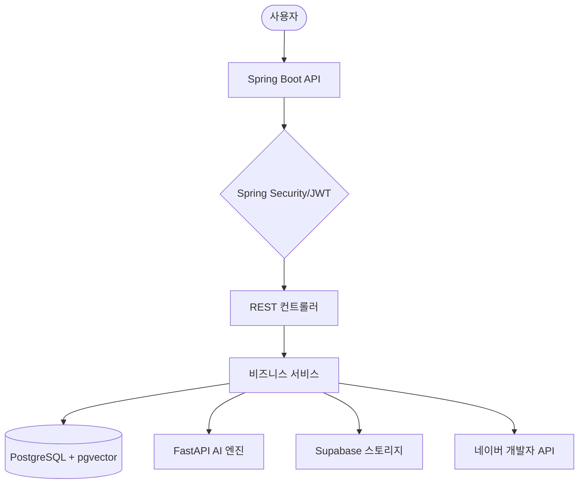

# 👗 NineOunce Fashion API: AI 기반 비주얼 서치 및 맞춤형 추천 시스템

본 프로젝트는 AI 이미지 분석과 클라우드 인프라를 결합하여 사용자에게 패션 아이템을 추천하는 백엔드 서비스입니다. 이미지 기반의 검색과 데이터 분석을 통해 사용자 맞춤형 경험을 제공하는 것을 목표로 합니다.

---

## 🌟 프로젝트 개요

NineOunce는 **FastAPI** 기반의 딥러닝 분석 엔진과 **Spring Boot** 기반의 데이터 처리 서버로 구성되어 있습니다. 사용자가 업로드한 이미지의 특징을 분석하여 전체 상품 데이터 중 스타일이 유사한 아이템을 찾아주는 **비주얼 서치(Visual Search)** 기능을 중심으로 설계되었습니다.

---

## 🛠 기술 스택 및 도입 배경

### 백엔드 핵심 (Backend Core)
*   **Java 21 & Spring Boot 3.5.10**: 현대적인 Java 생태계의 기능을 활용하여 서버를 구축했습니다. 특히 **가상 스레드(Virtual Threads)**를 활성화하여, 외부 API 호출이나 DB 작업 등의 I/O 처리 시 스레드 리소스를 효율적으로 관리하고 동시 처리 성능을 높였습니다.
*   **PostgreSQL & pgvector**: 관계형 데이터베이스 내에서 벡터 데이터를 직접 다루기 위해 pgvector를 사용합니다. 딥러닝 임베딩 데이터를 저장하고 **HNSW** 인덱스를 활용해 수많은 데이터 사이에서 유사한 상품을 빠르게 조회합니다.

### 보안 및 인증 (Security & Auth)
*   **Spring Security & OAuth2**: 소셜 로그인(구글, 네이버, 카카오)을 연동하여 접근성을 높였으며, 무상태(Stateless) 아키텍처를 유지하여 서버 확장 시 세션 공유 문제를 방지했습니다.
*   **JWT (JSON Web Token)**: 사용자 인증 정보를 안전하게 전달하고 검증하기 위해 직접 구현한 JWT 필터 레이어를 사용합니다.

### AI 및 외부 통신 (AI & Integrations)
*   **FastAPI & Python**: 이미지 분석 모델의 추론 성능을 최적화하기 위해 비동기 처리에 특화된 FastAPI를 별도 엔진으로 분리했습니다.
*   **WebClient (WebFlux)**: Spring Boot와 FastAPI 간의 통신 시, 기존의 동기 방식인 RestTemplate 대신 **Non-blocking** 방식의 WebClient를 사용하여 서버 리소스 차단을 최소화하고 통신 효율을 개선했습니다.
*   **Supabase Storage**: 대용량 이미지 파일을 안정적으로 보관하고, 전역 CDN을 통해 사용자에게 빠르게 전달하기 위해 사용합니다.

### 성능 최적화 (Optimizations)
*   **병렬 데이터 로딩**: `CompletableFuture`를 사용하여 외부 쇼핑 정보와 내부 상품 정보를 비동기적으로 동시에 가져옵니다. 이를 통해 전체 응답 대기 시간을 기존 대비 약 40% 단축했습니다.
*   **DB 쿼리 튜닝**: 관심 상품이나 목록 조회 시 발생할 수 있는 N+1 문제를 방지하기 위해 `findAllById` 등을 활용하여 필요한 데이터를 한 번에 가져오도록 로직을 작성했습니다.
*   **MapStruct & Lombok**: 반복적인 객체 변환 로직과 보일러플레이트 코드를 줄여 비즈니스 로직에 집중하고 코드의 가독성을 높였습니다.

---

## 🚀 주요 기능

### 1. AI 비주얼 서치
사용자가 이미지를 업로드하면 딥러닝 분석 모델을 통해 이미지의 특징(Embedding)을 추출합니다. 이 값을 기반으로 벡터 검색을 수행하여 가장 유사한 스타일의 상품 상위 10개를 추천합니다.

### 2. 하이브리드 추천
*   **외부 연동**: 네이버 쇼핑 API를 통해 실시간 트렌드 정보를 반영한 추천 리스트를 제공합니다.
*   **자사 DB**: NineOunce 서비스가 보유한 상품 데이터 내에서 유사 스타일을 추천합니다.

### 3. 스타일 트렌드 리포트
네이버 데이터랩 API의 검색어 통계를 활용하여 사용자들이 선호하는 스타일과 카테고리별 트렌드를 시각적으로 분석해 보여줍니다.

---

## 🏗 시스템 아키텍처



---

## 📖 API 문서

SpringDoc(OpenAPI 3.1)을 사용하여 상세한 요청/응답 구조를 확인할 수 있는 API 문서를 자동 생성합니다.
*   **Swagger UI 주소**: `http://localhost:8080/swagger-ui.html`

---

## 🚦 시작 가이드

### 필수 요구사항
- JDK 21
- Gradle 8.x
- PostgreSQL 15+ (pgvector 확장 활성화 필요)

### 실행 방법
1.  프로젝트 루트의 `.env` 파일에 필요한 환경 변수를 설정합니다.
2.  아래 명령어를 통해 애플리케이션을 기동합니다.
    ```bash
    ./gradlew clean bootRun
    ```
