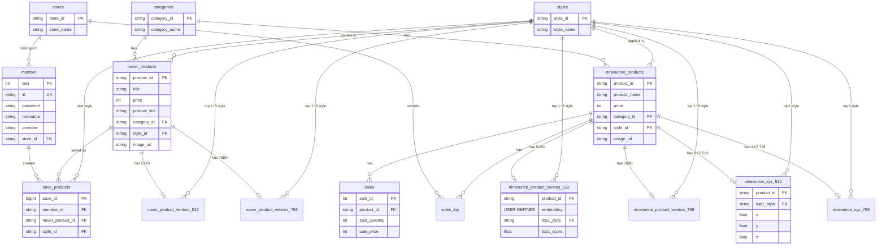

# Fashion API (NineOunce E-Commerce Backend)

본 프로젝트는 패션 이커머스 서비스(NineOunce)를 위한 **Spring Boot 기반 백엔드 API 서버**입니다. AI를 활용한 시각적 검색(Visual Search) 및 추천, 소셜 로그인 기반의 안전한 회원 관리, 트렌드 분석 등 첨단 쇼핑 인사이트 기능을 제공합니다.

## 🚀 주요 기술 스택 (Tech Stack)

### Backend Core
- **Framework**: Spring Boot 3.5.10
- **Language**: Java 21
- **Build Tool**: Gradle
- **Database**: PostgreSQL (Supabase 환경 연동)
- **ORM**: Spring Data JPA / Hibernate 6

### Security & Authentication
- **Spring Security** & **OAuth2 Client** (Google, Naver, Kakao 소셜 로그인 지원)
- **JWT (JSON Web Token)** (`com.auth0:java-jwt`) - 세션리스 인증 아키텍처 구현

### AI & Integration
- **FastAPI 연동**: Python 기반의 외부 분석 서버(포트 8000, 8001)와 통신하여 이미지 분석 및 512차원/768차원 벡터 임베딩 처리
- **pgvector**: PostgreSQL의 벡터 검색(Vector Similarity Search) 기능을 활용하여 이미지나 텍스트 기반 상품 형태(스타일) 간 코사인 유사도 연산

### Storage & Utility
- **Supabase Storage**: 회원 프로필 사진 및 분석용 이미지 원본 보관 용도
- **Swagger (Springdoc OpenAPI)**: API 명세 자동화 및 마크다운 테스트 UI (`/swagger-ui.html`)
- **P6Spy**: 개발 환경용 실행 실제 쿼리 파라미터 모니터링
- **MapStruct**: DTO-Entity 간 자동 변환 (컴파일 타임 안전성 및 보일러플레이트 제거)
- **Caffeine Cache**: 성능 제한 해소를 위한 로컬 인메모리 캐시

---

## 🛠 아키텍처 및 핵심 기술 심층 분석 (Technical Deep Dive)

단순히 라이브러리를 가져다 쓰는 수준을 넘어, 성능 최적화와 유지보수성을 고려하여 다양한 최신 기술을 코드 레벨에 도입했습니다.

### 1. ⚡ Virtual Threads (가상 스레드) 도입
- **적용점:** `application.properties` 내 `spring.threads.virtual.enabled=true` 옵션 지정
- **효과:** Java 21의 핵심 기능인 가상 스레드를 도입하여, 기존 OS 스레드 풀의 병목 한계를 극복했습니다. Python 기반의 **FastAPI 이미지 분석 서버 호출(WebClient 비동기 연동)**, **PostgreSQL 데이터베이스 쿼리 대기** 등 무거운 I/O Blocking이 발생하는 구간에서 자원 소모를 최소화하고 동시성 처리 성능(Throughput)을 비약적으로 끌어올렸습니다.

### 2. 🧠 pgvector 기반 AI 유사도 검색
- **적용점:** `RecommandRepository` 내 네이티브 쿼리 및 `NineounceXyz512`, `NineounceXyz768` 엔티티 매핑
- **효과:** 기존 RDBMS의 한계를 벗어나 PostgreSQL의 `pgvector` 확장을 활용합니다. 이미지 분석 결과로 추출된 512차원/768차원의 다차원 벡터 데이터를 데이터베이스 내부에서 **코사인 유사도(Cosine Similarity, `<=>` 연산자)** 로 직접 연산합니다. Application Layer(자바 메모리)로 수만 건의 데이터를 끌어올리지 않고 DB 단에서 즉시 연산·정렬함으로써 응답 속도를 최적화했습니다.

### 3. 🚀 MapStruct & Caffeine Cache 최적화
- **MapStruct (`@Mapper`):** 실행 중인 리플렉션(Reflection)을 사용하는 기존 ModelMapper와 달리, 컴파일 타임에 Entity ↔ DTO 양방향 변환 코드를 미리 자동 생성하여 **런타임 오버헤드(Runtime Overhead)를 말끔히 제거**하고 타입 안정성을 확보했습니다.
- **Caffeine Cache:** `spring-boot-starter-cache`를 통해 매번 DB를 조회할 필요가 없는 설정값이나 트렌드 고정 데이터(예: 랭킹 조회)에 로컬 인메모리 캐싱을 적용하여 실시간 API 응답 지연 단위(Latency)를 단축했습니다.

### 4. 🪪 무상태(Stateless) JWT & OAuth2 파이프라인
- **적용점:** `JWTAuthorizationFilter`, `OAuth2SuccessHandlerWithDB`
- **효과:** 세션을 서버 메모리에 저장하고 계속 참조해야 하는 번거로움을 피하고자 `com.auth0:java-jwt` 라이브러리를 이용했습니다. 카카오/네이버/구글의 OAuth2 인증 성공 직후 DB를 갱신하고 자체 토큰을 커스텀 발급하며, Filter 단에서 토큰 만료 및 위변조 발견 시 즉각 `401 Unauthorized` 예외 응답을 발생시켜 클라이언트의 자동 로그아웃을 유도하도록 방어적으로 설계되었습니다.

---

## 🔌 시스템 모듈 및 주요 API 명세 (Key Features & Endpoints)

프로젝트는 주요 도메인 및 용도별 컨트롤러(`*Controller`)로 깔끔하게 분리되어 있습니다.

### 1. 👕 AI 시각 검색 및 상품 추천 (`/api/recommand`)
- `GET /api/recommand/{productId}`: 특정 상품의 512D 벡터를 기준삼아 유사도 측정 및 네이버/내부 자사 상품 목록 추론 반환
- `GET /api/recommand/768/{productId}`: 고밀도 다차원(768D) 모델을 이용한 한 단계 스케일 업 된 상품 추천
- `POST /api/recommand/analyze`: (Multipart 형식) 사용자가 업로드한 이미지를 분석해 특징점과 바운딩 박스를 인식, 가장 유사한 형태의 옷 정보 매칭 결과 반환

### 2. 👥 회원 관리 및 소셜 인증 (`/api/members`)
- `POST /api/members/login`: 로컬 보안 로그인 처리와 동시에 JWT Access Token 동적 발급
- `POST /api/members/signup`: 신규 가입 폼 및 프로필 이미지 저장 지원
- `GET /api/members/me`: 검증된 JWT 토큰을 바탕으로 현재 페이지를 조회 중인 사용자의 식별 DB 값 반환
- `PATCH /api/members/update`: 사용자가 설정한 닉네임과 비밀번호 등 단변수 수정/저장

### 3. 🛍️ 관심 상품 (위시리스트) (`/api/save-products`)
- `POST /api/save-products`: 내가 선택한 네이버 외부 쇼핑몰 상품 ID와 스타일명(`userStyle`)을 내부 데이터에 위시리스트용으로 연관 매핑 및 보관
- `GET /api/save-products`: 내가 좋아요 누른 모든 외부 상품 및 스타일별 정보 다건 전체 조회
- `DELETE /api/save-products`: `List<String>` 형태의 배열을 통해 여러 묶음의 위시리스트 데이터를 단 한 번의 호출로 일괄 삭제 처리

### 4. 📈 트렌드 분석 및 로깅 (`/api/trends`, `/api/logs`)
- `GET /api/trends/shopping-insight`: 네이버 공개 쇼핑 클릭 데이터를 역산한 올해 한 해 최고 인기 패션 스타일 통합 스코어 계산 API 분배
- `GET /api/logs/view`: 브라우저 화면 안에서 시스템의 최신 서버 로그 스트림 파일(`fashion-api.log`) 상황을 시각적으로 모니터링할 수 있는 독립된 대시보드 뷰어 페이지 제공
- `GET /api/internal-products/map/768` (또는 `/map`): 프론트엔드 단의 UMAP 기반 3D Scatter Plot 렌더링을 위해 전체 상품군의 `X, Y, Z` 차원 좌표점들과 속성 매핑 배열 전달

---

## 📂 프로젝트 아키텍처 레이어 (Layer Architecture)

```text
src/main/java/com/kdt03/fashion_api
 ├── config/        # CORS 통신, JWT, OAuth2 보안 정책, 가상 스레드, WebClient 전역 설정 모듈
 ├── controller/    # HTTP 기반 RESTful API 엔드포인트 진입 경로 및 문서 매핑 매개체
 ├── domain/        # 데이터베이스 엔티티 (JPA Entities) + 입체 XYZ 벡터 좌표계 및 도메인 모델
 │   └── dto/       # 클라이언트 단방향 전송 객체 모음집 (불변성 보장)
 ├── repository/    # JpaRepository 확장 인터페이스 (Vector 유사도 계산 Query 및 Native Join)
 ├── service/       # 트랜잭션(@Transactional) 처리를 중심으로 비즈니스 플로우를 통제하는 로직
 └── util/          # JWT 커스텀 디코딩 및 발급 토큰화(Payload 분석) 등 필수 공통 함수 집합
```

---

## 💻 실행 및 배포 가이드 (How to run locally & Deploy)

### 필요 환경 변수 구축 (.env 작성 요령)
현재 사용 중인 루트 경로 폴더에 `.env` 파일을 만들거나 시스템 혹은 런타임 환경 변수에 아래의 항목들을 반드시 설정해야 데이터 연결과 소셜 통신이 구동됩니다. (로컬과 Docker 환경 모두 공용 필수)

```ini
# Database & General Security Auth
DB_PASSWORD=your_supabase_postgres_password
JWT_SECRET=your_super_secret_jwt_signature_key

# OAuth2 External Providers
OAUTH2_GOOGLE_CLIENT_ID=your_google_id
OAUTH2_GOOGLE_CLIENT_SECRET=your_google_secret
OAUTH2_NAVER_CLIENT_ID=your_naver_id
OAUTH2_NAVER_CLIENT_SECRET=your_naver_secret
OAUTH2_KAKAO_CLIENT_ID=your_kakao_id
OAUTH2_KAKAO_CLIENT_SECRET=your_kakao_secret
```

### 🐳 Docker 통합 컨테이너를 이용한 배포와 실행 (권장 방안)
성능 저하 및 레이어 분리를 극대화하기 위해 제공 중인 **Multi-stage Build (멀티 스테이지 빌드 최적화)** 방식의 `Dockerfile`입니다 (JDK로 무거운 용량의 빌드 컴파일을 진행한 후 마지막엔 매우 가벼운 JRE 환경만 넘겨서 자원을 절약합니다).

1. **Docker 최적화 이미지 빌드 시작**
   ```bash
   docker build -t fashion-api:latest .
   ```
2. **배포용 컨테이너 실행**
   준비한 환경 변수를 넘겨주며 내장 톰캣 전용 8080 포트를 점유하여 컨테이너를 구동 및 백그라운드 활성화합니다.
   ```bash
   docker run -d -p 8080:8080 \
     --env-file .env \
     --name fashion-backend \
     fashion-api:latest
   ```
3. 부팅 상태 확인 및 에러 검색: `docker logs -f fashion-backend`

### 💻 OS 시스템 터미널 구동 가이드 (Docker 미사용 / 로컬 테스트용)
플랫폼 제약이나 종속성 다운로드를 예방하기 위한 `gradlew` 래퍼 파일이 코드에 동봉되어 있으므로, Java 21이 이미 인스톨되어 있다면 즉각 테스트가 가능합니다. 터미널 경로를 본 프로젝트(fashion-api)로 이동하십시오.

```bash
# Windows (CMD, PowerShell 등의 환경)
> gradlew.bat build -x test
> gradlew.bat bootRun

# macOS / Linux (Mac의 경우 만약 권한 거부 시 사전에 권한 부여: chmod +x gradlew)
$ ./gradlew build -x test
$ ./gradlew bootRun
```

### 🔗 백엔드 API 서비스 접속 및 Swagger 디버깅 테스트
- **Swagger 인터페이스 UI**: 서버 구동이 완료된 후 브라우저 메인 주소창에 `http://localhost:8080/swagger-ui.html` URL을 명시하여 이동하시면, 내부에 코딩된 모든 백엔드 API 들을 간편하고 직관적으로 파라미터를 넘겨주며 직접 호출하고 테스트해 볼 수 있습니다.

---

## 🗄️ 데이터베이스 스키마 구조 (Entity Relationship Diagram)

서비스에서 운용 중인 Supabase(PostgreSQL)의 전체 테이블 및 연관 관계를 요약한 다이어그램입니다. `pgvector`가 적용된 모델(`_vectors_512`, `_vectors_768`) 및 3D 시각화가 지원되는 모델(`_xyz_`)이 포함되어 있습니다.


